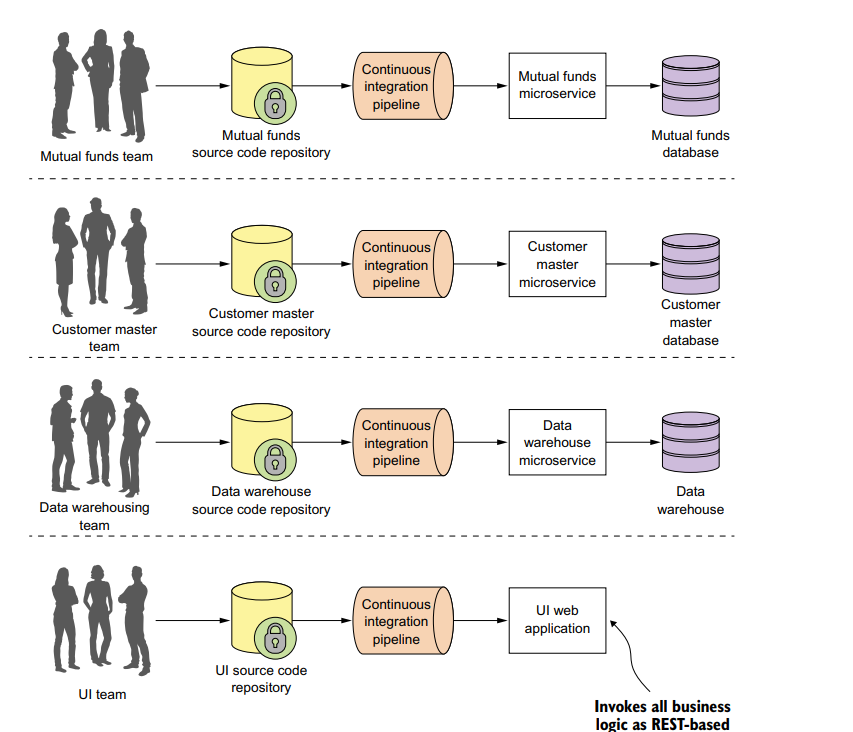

# Microservice

## What's a Microservice?

Microservice conceptsiyasi dastlab 2014 yilda dasturiy ta'minot ishlab chiqish hamjamiyatnining ongiga kirdi. 
Texnik va Tashkiliy jihatdan yirik, monolit ilovalarni kengaytirishga urinishning ko'plab muammolariga bevosita
javob bo'ldi. Esda tuting **Microservice** kichik, loosely coupled(erkin bog'langan), distirbuted(taqsimlangan)
servicedir. Microservicelar sizga katta hajmdagi dasturni olish va uni tor belgilangan mas'uliyat bilan oson
boshqariladigan componentlarga ajratish imkonini beradi. 

Microservice, bir so'z bilan aytganda, bizga yirik tizimimizni bir qator mustaqil hamkorlik qiluvchi komponentlarga
ajratish imkonini beradi. 

Microservice Arxitekturasi - bu biznes sohasi atrofida modellashtirilgan kichik, mustaqil servicelar to'plami sifatida
ilovani tuzadigan uslub.

Microservice Arxitekturasini yutiqlari.

1. Flexible (Moslashuvchan) - yangi funksionalitiylarni qo'shish ajratilgan servicelarda yani microsericelarda ancha 
oson kechadi sababi. Ishlayotgan kod qancha kichik bo'lsa, kodni o'zgartirish shunchalik murakkab bo'lmaydi va kodni
test qilish va uni deploy qilish uchun kamroq vaqt ketadi.

2. Resilient (Moslashuvchan) - microservicelarda ilovaning bir qismidagi buzilish butun ilovaning buzilishiga olib 
kelmaydi.  

## Spring Cloud

Spring Cloud - Spring boot ustiga qurilgan, microservicelarni tezda yaratish uchun bir qator xususiyatlarni taqdim
etadi. Ularni qanday qilib birgalikda ishlashini bilishi juda aqlli, minimal konfiguratsiyalar bilan servicelarni tezda
sozlashi mumkin.

Service registration, discovery, circuit breakers, proxies, logging va log tracing, monitoring, authentication va boshqalar.

## Decomposing

Shunday qilib, bitta katta dasturga ega bo'lish o'rniga, biz uni alohida, har xil, mini ilovalarga (yani servicelarga)
ajratamiz.

Har bir service ma'lum bir biznes domenini boshqaradi va foydalanuvchi uchun interface, biznes mantig'i va databasega 
ulanishni amalga oshirishni ta'minlaydi. 

## Single Function

Har bir Service o'ziga xos vazifa yoki mas'uliyatga ega. Va ha, serviceda ko'plab vazifalarni bajarishi mumkin, ammo 
ularning barchasi shu yagona funksiyaga tegishli.

## The Scope and risk of change

Servicelar boshqa servicelarni buzmagan holatda o'zgartirilishi kerak. Va tashqi interfaceni o'zgartirmagunimizcha,
boshqa servicelar uchnu hech qanday muammo bo'lmaydi. 

## Serverless

Bugungi kunda ishlatiladigan uchta asosiy cloud platforma turlari (IaaS, PaaS, SaaS). Biroq, Cloud platformani yangi turlari
paydo bo'lmoqda. Ushbu yangi platforma turlarga Functions as a Service (FaaS) va Container as a Service (CaaS) kiradi.
FaaS Serverless yani servicesiz kod bloklarni sifatida cloud platformalarni yaratish imkoni beradi.

## A Microservice Architecture Characteristics

- Applicationni logikasini yani mantig'ini yetkazib bera oladigan, aniq belgilangan mas'uliyat chegaralari bilan kichik
komponentlarga bo'linadi.
