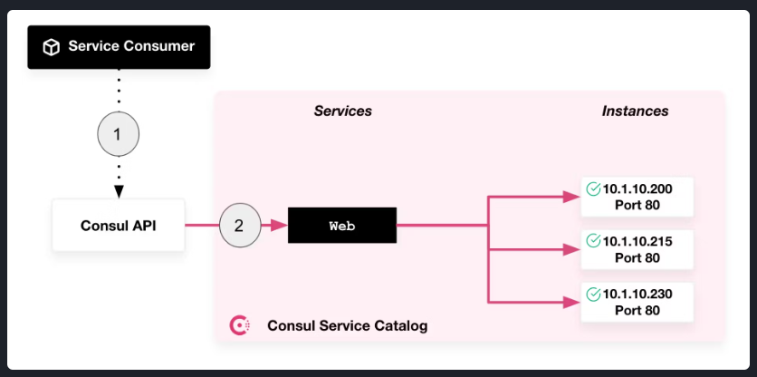

# Consul

Consul - bu HashiCorp tomonidan ishlab chiqilgan vosita bo'lib, u distributed yani taqsimlangan tizim va microservicelar
arxitekturasida servicelarni aniqlash va tarmoqni avtomatlashtirish uchun xususiyatlar to'plamini taqdim etadi.

Consulning asosiy xususiyatlari

`Service Discovery`: Consul servicelarga o'zlarni ro'yxatdan o'tkazish va boshqa servicelarni dinamik ravishda topish
imkonini beradi. Bu servicelar bir-birini topish va muloqot qilishi kerak bo'lgan microservicelar arxitekturasida
juda muhimdir.

`Health Checking`: Consul servicelarning to'g'ri ishlashiga ishonch hosil qilish uchun ularning sog'lig'ini tekshiradi.
Agar service sog'lig'ini tekshirishdan o'ta olmasa, consul uni rotatsiyadan olib tashlashi va boshqa trafikni unga
yo'naltirilishining oldini olishi mumkin.

`Key-Value Storage`: Consul konfiguratsiyalarni boshqarish, funksiyalarni almashtirish va boshqa maqsadlarda foydalanish
mumkin bo'lgan distributed key-value storage taqdim etadi. Bu centralized configuration serverga ehtijoy sezmasdan
konfiguratsiya sozlamalarini dinamik yangilash imkonini beradi.

---

HashiCorp Consul is a tool developed by HashiCorp that provides a set of features for service discovery and networking
automation within a distributed system or microservices architecture. It is part of the HashiCorp suite of tools, which
also includes products like Vagrant, Terraform, and Vault.

Key features of HashiCorp Consul include:

`Service Discovery`: Consul enables services to register themselves and discover other services dynamically. This is
crucial in a microservices architecture where services need to find and communicate with each other.

`Health Checking`: Consul can perform health checks on services to ensure they are operating correctly. If a service fails
its health check, Consul can take it out of rotation and prevent further traffic from being directed to it.

`Key-Value Storage`: Consul provides a distributed key-value store that can be used for configuration management, feature
toggles, and other purposes. This allows for dynamic updates of configuration settings without the need for a
centralized configuration server.

### Spring Cloud Consul features:

- Service Discovery: instances can be registered with the Consul agent and clients can discover the instances using
  Spring-managed beans

- Supports Spring Cloud LoadBalancer - a client side load-balancer provided by the Spring Cloud project

- Supports API Gateway, a dynamic router and filter via Spring Cloud Gateway

- Distributed Configuration: using the Consul Key/Value store

- Control Bus: Distributed control events using Consul Events

## What is service discovery?

Service Discovery bizga serviceni topish, holatni aniqlash va kuzatishda yordam beradi. Service Discovery service
catalogiga registiratsiya qiladi va saqlaydi. Ushbu service catalog sizning servicelarnigizni bir-birlarini so'rash
va muloqot qilish imkonini beruvchi yagona manba sifatida ishlaydi.

---

Service discovery helps you discover, track, and monitor the health of services within a network. Service discovery
registers and maintains a record of all your services in a service catalog. This service catalog acts as a single source
of truth that allows your services to query and communicate with each other.

