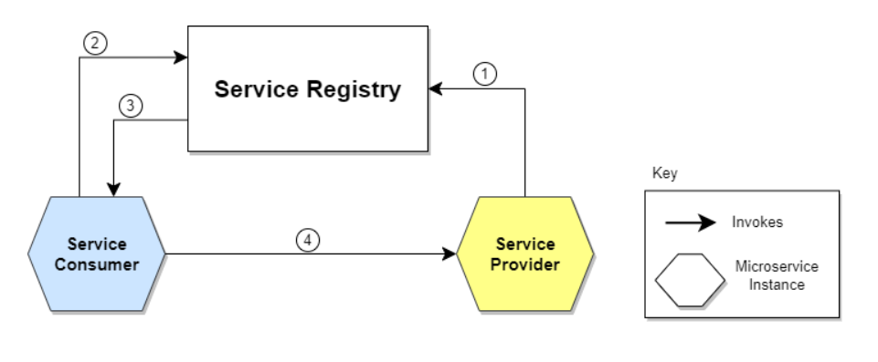

# Microservice

Microservice arxitekturasi dasturlarni ishlab chiqish uslublarida bir bo'lib, unda katta dastur bir-biri bilan aloqa
qiladigan kichik mustaqil servicelar to'plami sifatida quriladi. Bundan arxitekturada service registry va service
discovery servicelarni boshqarish va muvofiqlashtirishda hal qiluvchi rol o'ynaydi.

## Service Registry

Service registry bu microservicega asoslangan tizimdagi servicelar haqidagi ma'lumotlarni kuzatib boradigan markaz-
lashtirilgan katalog. U servicening joylashuvni (IP Address va Port), protocol va servicega tegishli boshqa 
metama'lumotlar uchun ma'lumotlar bazasi bo'lib xizmat qiladi.

Service Registry asosiy maqsadi servicelar ishga tushganda ro'yxatdan o'tkazish va ular o'chgandan ro'yxatdan olib
tashlash. 

Service Registry: Eureka

## Service Discovery

Service Discovery - bu microservicelar tizimida dinamik ravishda servicelarni topish jarayoni. Servicening joylashuvi
va xususiyatlari to'g'risida kerakli ma'lumotlarni olish uchun service registry o'z ichiga oladi. 

Service Discoery asosiy maqsadi servicelarni static configuratsiyalarsiz topish va bir-birlari bilan muloqot qilish
imkonini berishdir. Bu servicelarni ilovaning umumiy funksionalligiga ta'sir qilmasdan qo'shish yoki olib tashlash
mumkin bo'lgan dinamik va moslashuvchan tizimga imkon beradi.

Service Discovery: Consul va Apache Zookeeper
