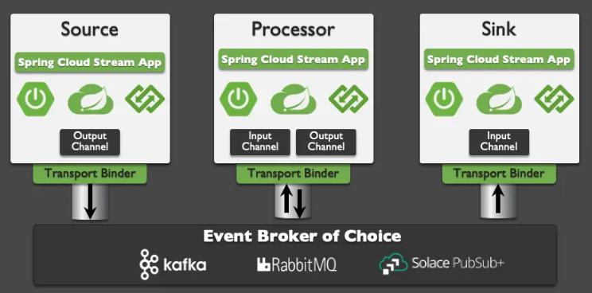

# Spring Cloud Stream

Cloud Stream Basics
Spring Cloud Stream is a framework for creating highly scalable, event-driven microservices connected by pluggable
messaging services. Messaging services are pluggable via Binders that we'll cover in a bit. The framework is based on
Spring Boot and Spring Integration.

Spring Cloud Stream has three different types of message exchange contracts as pictures below.

* Suppliers are sources of events
* Sinks are consumers of events
* Processors are both consumers and subscribers of events

## Message Exchange Contracts Map to Java Functions

As of Spring Cloud Stream v3 the preferred programming model is to use Java Functions to implement your cloud stream
apps.

We just mentioned the 3 types of Cloud Stream message exchange contract are "Sources", "Sinks" and "Processors". Those
map to functions as follows:

* `java.util.function.Supplier` -> Source [Producer/Publisher of Events]
* `java.util.function.Consumer` -> Sink [Subscriber/Consumer of Events]
* `java.util.function.Function` -> Processor [ Consumes, Processes, and Produces Events ]

## Binders

Spring Cloud Stream Binders are really what make the framework useful. Binders provide an abstraction layer between your
code and the messaging systems over which events are flowing. This allows you to write your code without having to worry
about learning messaging APIs! When messages are sent or received from the messaging system they pass through the
messaging system specific binder which knows how to communicate with that specific message broker.

As of the creation of this codelab the available Cloud Stream Binders are:

* RabbitMQ
* Apache Kafka
* Amazon Kinesis
* Google PubSub
* Solace PubSub+
* Azure Event Hubs
* Apache RocketMQ

## Communication Models

Instead of having to learn Messaging APIs, developers just have to understand the communication models that Spring Cloud
Stream supports. There are 3 supported models, but support varies per binder.

* Publish-subscribe: subscribers are independent from each other & receive events in order
* Consumer groups: fan-out and load-balancing across multiple consumers
* Stateful partitioning support: in-order processing for consistency and performance